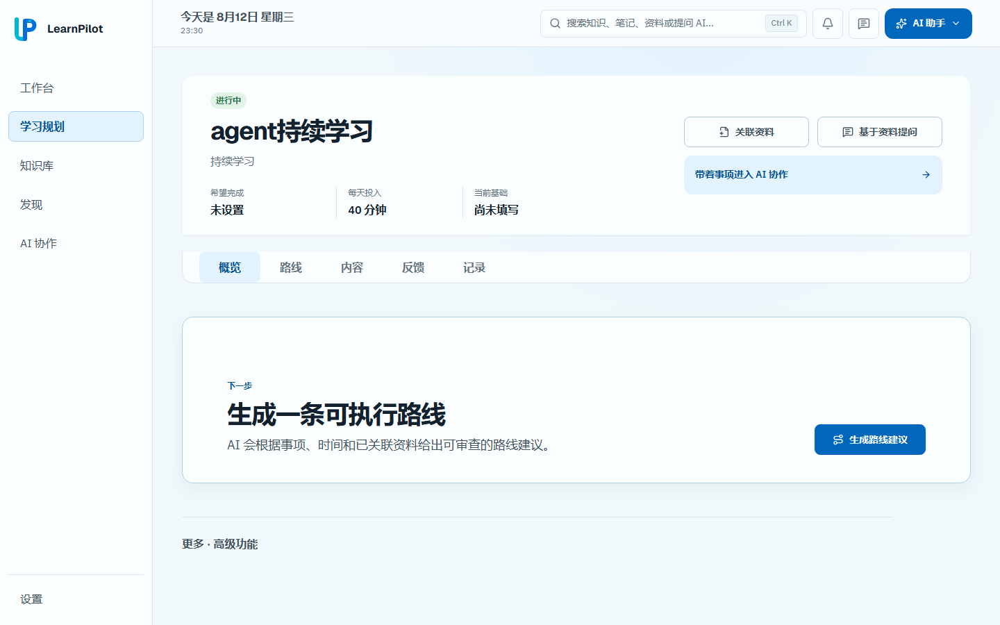
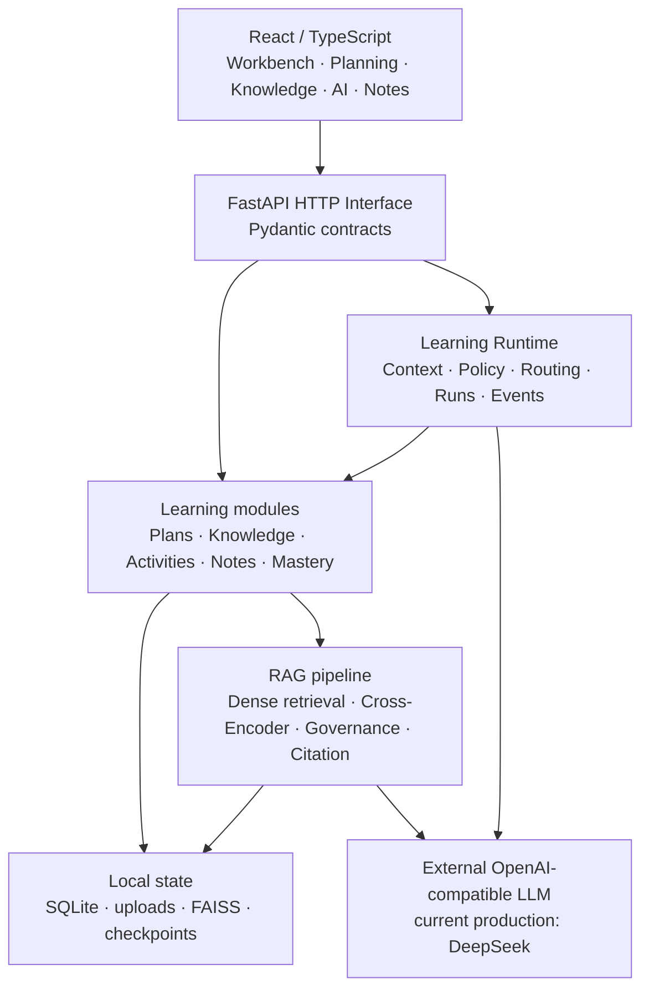
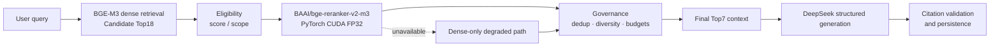

<div align="center">
  
  <h1>LearnPilot</h1>
  <p><strong>本地优先的 AI 学习工作台</strong></p>
  <p>学习规划 · 资料知识库 · Evidence-grounded RAG · AI 协作 · 学习记录</p>
  <p>
    
    
    
    
    
    
  </p>
</div>

## 项目简介

LearnPilot 是一个面向个人持续学习的 **Personal Learning Workspace**。它把目标与课程规划、本地资料库、基于证据的问答、AI 协作、笔记、练习与复盘连接为一条可追溯工作流。

项目重点不是给通用聊天界面增加几个学习标签，而是处理三个工程问题：如何让回答受本地证据约束，如何用冻结评测推动 RAG 架构决策，以及如何让 GPU 推理、失败降级和写操作治理成为可复现的产品能力。

```text
资料 → 本地知识库 → 学习规划 / 工作台 → 基于资料的 AI 问答 → 引用、笔记与学习记录
```

## 核心亮点

- **Evidence-grounded RAG**：BGE-M3 dense retrieval、Cross-Encoder reranking、Top7 context governance、引用校验与资料不足拒答组成完整可信链路。
- **Evaluation-driven architecture**：用 72-case / 132-claim 冻结评测、TopK 边界审计和 lexical stress test 决定生产结构，而不是凭直觉堆叠检索组件。
- **GPU runtime engineering**：将 reranker 的 primary runtime 固化为 PyTorch CUDA FP32，验证延迟、显存、顺序等价性、模型单例与启动契约。
- **Reliability first**：CUDA 或 reranker 不可用时稳定降级到 Dense-only，并返回 degraded metadata；索引或证据不足时不调用生成模型。
- **Learning Runtime harness**：按上下文、策略和能力边界路由 curriculum、tutor 与 constrained operations；重要写操作采用 proposal / confirmation。
- **完整学习闭环**：目标、课程、知识点、资料、问答、笔记、练习、错题、掌握度与复习记录共享同一业务状态。

## 产品展示

以下截图来自现有的最终视觉验收产物，没有为 README 重新制造演示数据。

| 学习规划 | Evidence-grounded RAG |
| --- | --- |
|  |  |

<p align="center">
  
  <br />
  <sub>受能力边界约束的 AI 协作界面</sub>
</p>

## 架构概览

LearnPilot 是单用户、本地优先的模块化单体。React 前端通过 JSON / SSE 使用 FastAPI HTTP Interface；业务事实留在 SQLite，资料向量留在本地 FAISS，生成能力通过 OpenAI-compatible Interface 接入当前配置的 DeepSeek。



完整的模块、Interface、Seam、Adapter、状态和取舍见 [Architecture](docs/architecture.md)。

## Production RAG Pipeline

生产检索把候选召回深度与最终上下文深度解耦：



```text
User Query
→ BGE-M3 Dense Retrieval Top18
→ Eligibility
→ BAAI/bge-reranker-v2-m3 CUDA FP32
→ Governance
→ Final Top7
→ DeepSeek
→ Citation
```

`RAG_CANDIDATE_TOP_K=18` 优先保证 candidate recall；cross-encoder 对整组候选做更精细的相关性排序；`RAG_FINAL_CONTEXT_TOP_K=7` 控制最终 evidence density、噪声和 token cost。Top7 不是行业默认值，而是本项目边界审计的结果：Top6、Top7、Top8 的 full-required coverage 分别为 `57/72`、`59/72`、`59/72`，且 Top7 的 12,000 字符预算违规为 `0/72`。因此 6→7 有真实边际收益，7→8 没有新增 evidence coverage。

### 为什么使用 Cross-Encoder，而没有保留 Hybrid

在冻结的 72-case / 132-claim 评测中，A（Dense）到 C（Dense + Cross-Encoder）的 fully correct cases 从 `50/72` 到 `53/72`，`SUPPORTED_CORRECT` 从 `92/132` 到 `105/132`，answerability 从 `60/72` 到 `67/72`，说明 reranker 带来可测增量。

候选 D（Dense + BM25 + RRF + Reranker）在主 benchmark 的目标集合没有相对 C 的 unique fixes；额外 lexical/domain-shift stress test 中，C 与 D 的 Hit@18 都是 `9/10`，D unique fixes 为 `0`。所以 V1 不保留尚未证明增量价值的 BM25/RRF 层；这不是“Hybrid 对所有场景无效”的普遍结论。

## RAG 评测与 CUDA Runtime

| 关注点 | 结果 | Canonical evidence |
| --- | --- | --- |
| 真实世界语料 | 11 documents / 442 chunks；72 cases / 132 gold claims | [corpus](evals/rag_real_world_corpus/v1/results/ingestion_v1/20260813T131304Z-ac0a8cee/result.json) · [gold audit](evals/rag_real_world_corpus/v1/gold/v1/distribution_audit.json) |
| Dense → Cross-Encoder | fully correct `50→53/72`；supported correct claims `92→105/132`；answerability `60→67/72` | [blinded review metrics](evals/rag_real_world_corpus/v1/results/hybrid_rerank_phase4_v1_1/20260814T131417Z-04dfc031/unblinded_metrics.json) |
| CUDA FP32 latency | CPU warm P50 `7797.075 ms` → CUDA P50 `469.872 ms`；P95 `589.381 ms`；mean `483.315 ms`；max `645.509 ms`；P50 speedup `16.594×` | [latency](evals/rag_real_world_corpus/v1/results/c_v1_3b_cuda_fp32_full/20260816T050910Z-fbb5cec1/latency_results.json) |
| CUDA memory / equivalence | peak reserved VRAM `2896 MiB`；reranker order、governed historical Top6、final context、required evidence 均 `72/72` 等价 | [memory](evals/rag_real_world_corpus/v1/results/c_v1_3b_cuda_fp32_full/20260816T050910Z-fbb5cec1/gpu_memory_results.json) · [equivalence](evals/rag_real_world_corpus/v1/results/c_v1_3b_cuda_fp32_full/20260816T050910Z-fbb5cec1/equivalence_results.json) |
| Lexical stress | C Hit@18 `9/10`；D Hit@18 `9/10`；D unique fixes `0` | [stress metrics](evals/rag_real_world_corpus/v1/results/c_v1_4_lexical_domain_shift/20260816T061649Z-3dc82771/summary_metrics.json) |
| Final context boundary | Top6 `57/72`；Top7 `59/72`；Top8 `59/72`；Top7 budget violations `0/72` | [boundary](evals/rag_real_world_corpus/v1/results/rag_context_selection_boundary_audit/20260816T094403Z-boundaryaudit/selection_boundary_decision.json) · [budget](evals/rag_real_world_corpus/v1/results/rag_candidate_final_depth_decoupling/20260816T101548Z-depthdecouple/context_budget_validation.json) |

CUDA 的 `72/72` 等价性来自当时冻结的 historical Top6 contract；后续 Top7 由独立、确定性的 production replay 验证。两组证据没有混用。

### Engineering decisions

- 用 claim-level、case-level 与 answerability 指标共同判断检索质量，不声称“100% RAG accuracy”。
- Cross-Encoder 在 CPU 上质量有增量但延迟不合格；ONNX Runtime FP32 CPU 保持语义等价，却把 P50 从约 `7.8s` 提高到约 `10.4s`，因此拒绝。
- PyTorch CUDA FP32 在保持冻结排序契约的同时把 reranker P50 降到约 `470ms`，成为 primary runtime。
- 候选 Top18 与最终 Top7 分离，让 recall 和 context precision 成为可独立治理的目标。
- CUDA / reranker 不可用时进入带 degraded metadata 的 Dense-only path，而不是让问答整体失效。
- 引用 ID 有效性与引用语义支持分开评估；结构正确不自动等于内容被证据完整支持。

## Learning Runtime / AI 协作

Learning Runtime 是一个受控执行 harness，而不是无边界的自主 Agent 平台：

1. **Context assembly**：聚合当前学习目标、课程、资料、会话与允许的历史状态。
2. **Policy and routing**：把请求分发给 curriculum、tutor 或 constrained operations 能力。
3. **Grounded execution**：资料问答进入 RAG；计划与辅导使用相应业务 contract。
4. **Proposal / confirmation**：重要写操作先生成提案，用户确认后才进入状态变更。
5. **Runs and events**：记录运行、事件、失败类型和 degraded 状态，为前端反馈与故障审计提供依据。

这套边界让 LLM 负责解释、规划草案与自然语言交互，把权限、幂等、确认、状态迁移、引用校验和失败降级留给确定性代码。

## 核心工作流

| 工作流 | 用户价值 | 工程约束 |
| --- | --- | --- |
| 学习规划 | 目标 → 课程 → 知识点 → 行动与复习 | 状态变更受业务 contract 与确认流程保护 |
| 资料知识库 | PDF / Markdown / TXT → parsing → chunking → embedding → FAISS | 索引、manifest 和业务数据均保留本地 |
| RAG 问答 | 指定资料范围 → Top18 → rerank → Top7 → answer + citations | 无证据拒答；引用 ID 与语义支持分开验证 |
| AI 协作 | contextual request → routing → tutor / curriculum / operations | 写操作需要 proposal / confirmation；失败返回安全消息 |
| 学习记录 | 笔记、练习、错题、掌握度、复习建议形成反馈闭环 | 规则与模型建议分层，保留可追溯状态 |

## 技术栈

| 层 | 当前实现 |
| --- | --- |
| Frontend | React 19、TypeScript 5.8、Vite 7、React Router 7、TanStack Query 5、Recharts 3 |
| Backend | Python 3.11、FastAPI、Pydantic 2、SQLAlchemy 2、Alembic、Uvicorn |
| Knowledge | pypdf、sentence-transformers、`BAAI/bge-m3`、FAISS `IndexFlatIP` |
| AI / orchestration | OpenAI-compatible LLM（当前 DeepSeek）、Learning Runtime harness、LangGraph constrained operations workflow |
| Reranking | `BAAI/bge-reranker-v2-m3` revision `953dc6…d41e`、PyTorch CUDA FP32 |
| State | SQLite business DB、SQLite LangGraph checkpoint、local uploads、FAISS index + manifest |

## 工程验收

以下是 canonical Final Product Audit 冻结的验收结果，不表示本次 README 整理重新执行了全量回归或 GPU benchmark。

| Gate | Result |
| --- | --- |
| Backend regression | `428/428 PASS` |
| Frontend regression | `148/148 PASS` |
| Focused production RAG | `34/34 PASS` |
| OpenAPI / RAG contract | `PASS` |
| CUDA FP32 Top18 → Top7 / singleton | `PASS` |
| Dense fallback | `PASS` |
| Core workflows / runtime reproducibility / data integrity | `PASS` |
| Release severity | `P0 = 0`、`P1 = 0`；3 个 P2 已作为边界记录 |

详见 [LearnPilot Final Product Audit](evals/final_product_audit/20260816T140758Z-finalproductaudit/LEARNPILOT_FINAL_PRODUCT_AUDIT.md) 与 [authoritative evidence inventory](evals/final_product_audit/20260816T140758Z-finalproductaudit/authoritative_evidence_inventory.json)。

## 设计边界

- **Local-first, single-user**：当前没有多租户、身份权限或云端同步层；SQLite、上传资料、FAISS、checkpoint 和模型缓存都在本机。
- **LLM 不是状态真源**：生成模型提供解释、建议与草案；引用校验、权限、确认、幂等与业务状态由代码控制。
- **不伪装外部能力**：Discover 目前是轻量入口；产品不声称具备联网搜索、OCR、图片/音视频理解或成熟推荐系统。
- **不是自主多 Agent 平台**：Learning Runtime 只暴露受约束的业务能力，没有 Supervisor 或 MCP 外部数据源。
- **离线模型边界**：embedding / reranker 模型、`.venv-cuda`、用户 DB、上传资料、secrets 与 runtime artifacts 均不属于 Git 仓库。

## Quick Start

<details>
<summary><strong>展开 Windows / PowerShell 本地启动步骤</strong></summary>

### Prerequisites

- Python 3.11；Node.js 与 npm。
- Primary reranker path 需要 NVIDIA GPU 和兼容的驱动，以及安装在 `.venv-cuda` 中的 CUDA-enabled PyTorch wheel。已验证环境为 Python 3.11.9、`torch 2.12.1+cu126`；wheel 自带所需 CUDA runtime，**不要求单独安装完整 CUDA Toolkit 12.6**。
- 本地 `BAAI/bge-m3` embedding cache，以及 `BAAI/bge-reranker-v2-m3` revision `953dc6f6f85a1b2dbfca4c34a2796e7dde08d41e` snapshot。
- DeepSeek API credential；不要把真实 key 提交到仓库。

### 1. Environment

```powershell
Copy-Item .env.example .env
py -3.11 -m venv .venv-cuda
.\.venv-cuda\Scripts\python.exe -m pip install -r .\backend\requirements.txt
```

`backend/requirements.txt` 当前没有固定 CUDA PyTorch wheel；请按本机 GPU/driver 为 `.venv-cuda` 安装兼容 wheel，并先确认：

```powershell
.\.venv-cuda\Scripts\python.exe -c "import torch; print(torch.__version__, torch.cuda.is_available())"
```

编辑根目录 `.env`。至少设置以下启动契约（路径只是占位，不要复制作者机器路径）：

```dotenv
APP_NAME=LearnPilot
LLM_API_KEY=<your-deepseek-api-key>
LLM_BASE_URL=https://api.deepseek.com
LLM_MODEL=deepseek-v4-flash
HF_HOME=<path-to-huggingface-cache>
EMBEDDING_MODEL_NAME=BAAI/bge-m3
EMBEDDING_LOCAL_FILES_ONLY=true
RAG_CANDIDATE_TOP_K=18
RAG_FINAL_CONTEXT_TOP_K=7
RAG_MAX_SOURCES_PER_MATERIAL=3
RAG_RERANKER_ENABLED=true
RAG_RERANKER_MODEL_PATH=<path-to-bge-reranker-v2-m3-snapshot>
RAG_RERANKER_DEVICE=cuda
VITE_API_BASE_URL=http://127.0.0.1:8000/api
```

### 2. Database and backend

首次启动或 migration 更新后：

```powershell
Set-Location backend
..\.venv-cuda\Scripts\python.exe -m alembic upgrade head
Set-Location ..
```

从仓库根目录使用已验证的 production launcher：

```powershell
powershell.exe -NoProfile -ExecutionPolicy Bypass -File .\backend\scripts\start_rag_cuda_backend.ps1
```

Backend：`http://127.0.0.1:8000`；OpenAPI：`http://127.0.0.1:8000/docs`。

### 3. Frontend

另开一个 PowerShell：

```powershell
Set-Location frontend
npm ci
npm run dev
```

Frontend：`http://127.0.0.1:5173`。若 reranker 初始化或推理失败，backend 会稳定降级到 Dense-only retrieval 并返回 `dense_fallback` / degraded metadata；若索引或证据不可用，则在调用生成模型前拒答。

</details>

## 项目结构

```text
.env.example            # public configuration contract; no secrets
backend/
  app/                  # FastAPI、领域模块、Learning Runtime、RAG 与持久化
  alembic/              # SQLite schema migrations
  scripts/              # production CUDA launcher
  tests/                # backend regression and contract tests
frontend/
  src/                  # React routes、UI modules、API clients、co-located tests
docs/
  architecture.md       # canonical system architecture
  screenshots/          # vetted public product screenshots
evals/
  rag_real_world_corpus/v1/  # frozen gold、benchmark 与 RAG decision evidence
  final_product_audit/       # product-level release evidence
  repository_cleanup/       # canonical repository map
```

Reranker snapshot 位于仓库外部，通过 `RAG_RERANKER_MODEL_PATH` 配置；`.venv-cuda`、本地数据、模型缓存和 secrets 都不是源码。

## 已知限制

- 产品当前是本地单用户部署，不包含多租户、权限系统、云部署、联网搜索、OCR 或图片/音视频理解。
- Learning Runtime 是受控的能力路由与执行 harness，不是自主多 Agent 平台；没有 Supervisor 或 MCP 外部数据源。
- Discover 当前是轻量入口，不代表成熟的个性化推荐系统。
- **Generation nondeterminism**：最终固定 5-case production closure 中有 1 个复杂 multi-branch 技术问题出现 partially-correct omission。检索与 Top7 evidence 完整、citation validity 正常，但生成模型遗漏一个已有证据支持的分支。Final Product Audit 将其判定为 documented limitation，而非稳定 P0/P1；`1/5` 是小型 closure sample，不能解释为总体 `20%` 失败率。

当前 product-level 状态见 [LearnPilot Final Product Audit](evals/final_product_audit/20260816T140758Z-finalproductaudit/LEARNPILOT_FINAL_PRODUCT_AUDIT.md)，证据位置以 [Repository Cleanup canonical map](evals/repository_cleanup/20260816T151918Z-repositorycleanupclosure/canonical_repository_map.json) 为准。

## 文档入口

- [System Architecture](docs/architecture.md)
- [RAG Design](docs/rag.md)
- [Learning Runtime / Agent Architecture](docs/agent-architecture.md)
- [API Guide](docs/api.md)
- [Evaluation Guide](docs/evaluation.md)
- [Design System](design.md)
- [Interview Guide](docs/interview-guide.md)
- [Final Product Audit](evals/final_product_audit/20260816T140758Z-finalproductaudit/LEARNPILOT_FINAL_PRODUCT_AUDIT.md)
- [Canonical Repository Map](evals/repository_cleanup/20260816T151918Z-repositorycleanupclosure/canonical_repository_map.json)

<div align="center">
  <strong>Plan deliberately. Learn from evidence. Keep the loop local.</strong>
</div>
