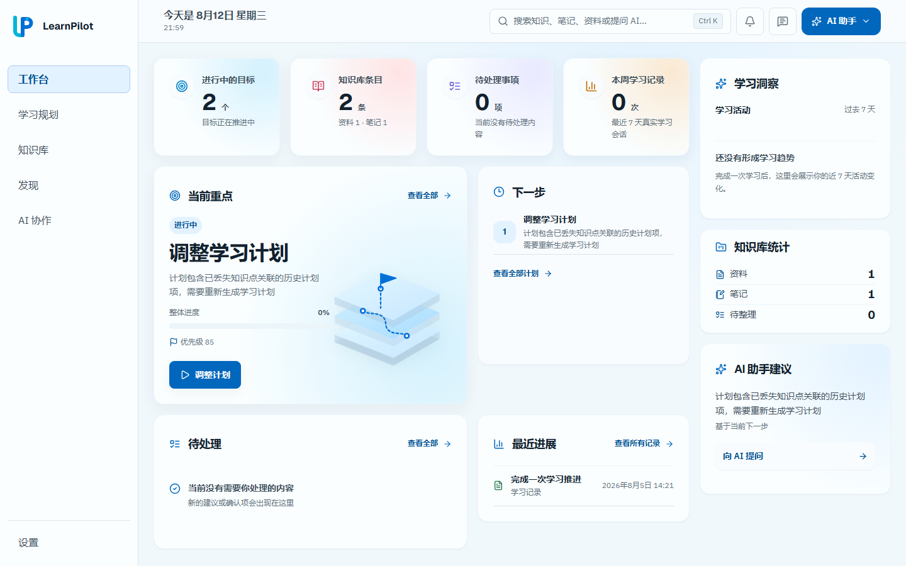
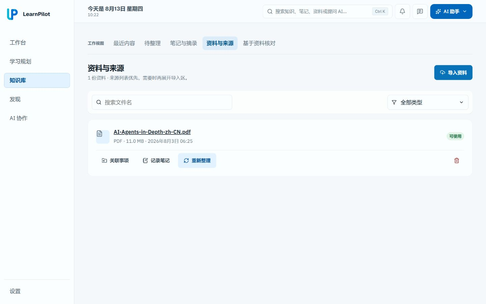
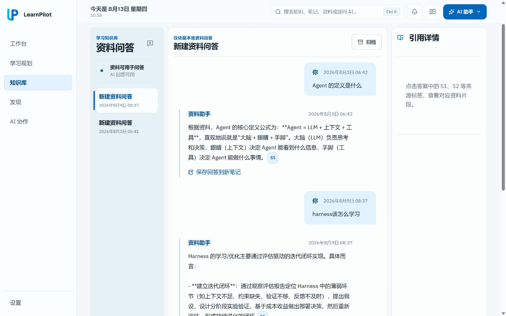
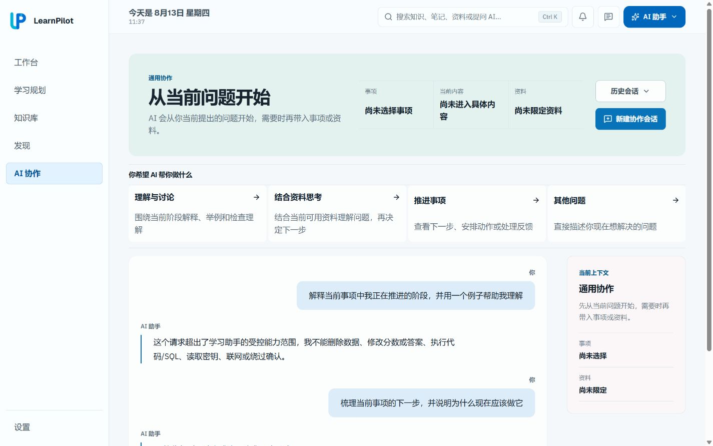
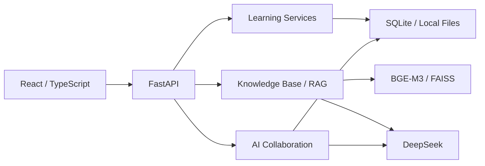

<div align="center">
  
  <h1>LearnPilot</h1>
  <p><strong>本地优先的 AI 学习工作台</strong></p>
  <p>学习规划 · 资料知识库 · 基于证据的 AI 问答 · AI 协作 · 学习记录</p>
  <p>
    
    
    
    
    
  </p>
</div>

## 项目简介

个人学习往往散落在资料文件、计划清单、AI 对话和笔记中：资料没有进入计划，对话不了解个人知识库，学过的内容也难以成为下一步行动。

LearnPilot 把学习规划、本地知识库、AI 辅导、笔记、练习和复习连接成一条持续流程。用户可以从目标出发组织课程与知识点，把资料沉淀为可检索的个人知识库，再将学习结果保留为后续可继续使用的状态。

它也不只是一个聊天或 RAG 演示：AI 回答需要回到真实资料，重要结论带有来源引用；关键路径经过离线评测，并在 GPU 或重排模型不可用时保留可用的降级方案。

## 核心亮点

- **完整学习工作台**：在同一产品中连接规划、知识库、AI 辅导、笔记、练习与学习记录。
- **基于证据的 RAG**：先从真实资料找到证据，再经过 Cross-Encoder 精排，由 DeepSeek 生成带来源引用的回答。
- **评测驱动的架构**：使用 72 个真实问题比较检索方案，根据结果选择 Cross-Encoder，没有为了结构复杂而保留 Hybrid 层。
- **GPU 推理优化**：重排延迟从 CPU 约 `7.8s` 降至 CUDA 约 `470ms`，P50 加速约 `16.6×`。
- **贴合学习状态的 AI 协作**：结合当前目标、课程位置和资料范围提供辅导或规划，重要状态变更仍需用户确认。
- **可靠性设计**：重排模型不可用时退化到纯 Dense 检索，同时保留引用校验与清晰的错误反馈。

## 产品展示

五个主要界面串起从学习目标、资料沉淀到 AI 辅导和持续复习的完整路径。

### 01 · Learning Workspace



Workbench 汇总当前目标、待办、近期进展和复习状态，让用户从统一入口继续当天的学习。

首页优先呈现“现在该做什么”，并把相关目标、资料和最近记录放在同一视野中。

### 02 · Plan Learning Goals and Curriculum


从目标出发组织课程、知识点和学习计划，并由用户确认重要的规划变更。

计划既可以持续调整，也会保留与资料、学习活动和复习状态之间的联系。

### 03 · Build a Personal Knowledge Base



PDF、Markdown 和文本资料在本地完成解析、切片、向量化与索引，成为学习和问答的真实依据。

用户可以管理资料、笔记和待整理内容，并从来源回到关联的学习事项。

### 04 · Ask Grounded Questions with Citations



系统从资料中检索并精排证据，再生成带来源引用的回答，方便用户回到原文核验。

资料不足时会明确提示，而不是用缺少依据的内容补齐答案。

### 05 · Collaborate with AI and Continue Learning



AI 会结合目标、学习位置和资料范围提供解释、练习或规划建议，并把结果连接到后续学习。

涉及正式学习状态的操作仍由用户确认，AI 不会在后台自行改写计划。

## 系统架构

LearnPilot 是本地优先的模块化单体。React 前端调用 FastAPI，学习业务、知识库问答和 AI 协作共用本地状态；DeepSeek 负责生成，本地模型负责向量化与重排。



学习目标、课程、笔记、练习和掌握状态保存在 SQLite；上传资料与 FAISS 索引留在本机。只有确实需要生成内容时才调用配置的 DeepSeek API，个人模型文件和用户数据库都不进入代码仓库。

前端通过普通 API 与流式响应呈现学习状态和 AI 输出。业务规则、用户确认、引用检查与错误处理由后端负责，避免把关键状态直接交给生成模型决定。

更完整的模块边界、数据流和技术取舍见 [Architecture](docs/architecture.md)。

## RAG 与 AI 设计

知识问答遵循“先找证据，再生成回答”的顺序。资料不足时系统会明确说明，而不是只依赖模型已有知识补全答案。

```text
用户问题
→ 从个人资料库召回 18 个相关片段
→ Cross-Encoder 精排
→ 选择最多 7 个高价值证据
→ DeepSeek 生成回答
→ 返回来源引用
```

| 设计问题 | 当前选择 | 目的 |
| --- | --- | --- |
| 候选召回 | Dense Top18 | 尽量避免在第一步漏掉相关证据 |
| 相关性排序 | Cross-Encoder | 更准确地比较问题与候选片段 |
| 生成上下文 | Final Top7 | 控制噪声、长度和生成成本 |
| 回答输出 | DeepSeek + citations | 让回答能够回到来源核验 |

候选召回数量和最终上下文数量服务于不同目标：前者优先避免漏掉证据，后者控制噪声与生成成本。离线边界测试显示，从 6 个增加到 7 个证据能修复两个真实遗漏，而从 7 个增加到 8 个没有新增收益，因此生产流程重排 18 个候选，并最多选择 7 个片段进入生成上下文。

在 72 个问题的评测中，纯 Dense 检索得到 `50/72` 个完全正确结果，引入 Cross-Encoder 后提升到 `53/72`。这证明精排对当前语料有实际增益，而不是只增加模型复杂度。

项目也评估过 Dense + BM25 + RRF + Reranker，但在主评测和额外的词法压力测试中，都没有观察到相对 Dense + Reranker 的独特修复，因此 V1 没有保留额外 Hybrid 层。

AI 协作会结合当前学习目标、课程位置和资料范围选择辅导、课程规划或受控学习操作；涉及正式学习状态变更时，仍由用户确认。

重排模型或 GPU 不可用时，问答会退化到纯 Dense 检索；索引或证据不足时，在调用 DeepSeek 前停止。引用是否存在和内容是否真正受到证据支持也会分开检查。

因此，RAG 的职责不仅是“搜到内容”，还包括控制进入模型的证据数量、标记使用过的来源，并把无法可靠回答的情况转化为清晰的产品反馈。

## 工程与评测亮点

| 项目 | 结果 |
| --- | --- |
| RAG 评测 | 72 cases |
| Dense → Cross-Encoder | 完全正确 `50/72 → 53/72` |
| Reranker runtime | CPU `≈7.8s` → CUDA `≈470ms`，约 `16.6×` |
| Backend regression | `428/428 PASS` |
| Final Product Audit | `P0=0 / P1=0` |

曾验证 ONNX Runtime CPU 路径，但实际延迟比原 PyTorch CPU 更高，因此最终采用 CUDA。CUDA FP32 版本通过冻结排序与上下文等价性验证，没有为了速度改变 RAG 语义；完整结果见 [Evaluation](docs/evaluation.md)。

测试覆盖业务逻辑、API、前端交互和关键失败路径。RAG 方案则使用固定问题集比较检索质量、延迟和上下文边界，使“选择哪个方案”能够回到可重复的结果，而不是只依赖主观体验。

## 技术栈

| 层 | 技术 |
| --- | --- |
| Frontend | React · TypeScript · Vite |
| Backend | FastAPI · SQLAlchemy · Alembic |
| AI / RAG | DeepSeek · BGE-M3 · FAISS · bge-reranker-v2-m3 · PyTorch CUDA |
| Data | SQLite · local files |

## Quick Start

Windows + Python 3.11 + Node.js + NVIDIA GPU

<details>
<summary><strong>展开本地启动步骤</strong></summary>

### 1. 获取代码与准备环境

项目需要 DeepSeek API key、本地 BGE-M3 embedding cache，以及 bge-reranker-v2-m3 模型文件。请勿提交真实 key、模型或个人数据；模型文件应保存在仓库外部目录。

```powershell
git clone https://github.com/yewuyan100/LearnPilot.git
Set-Location LearnPilot
```

创建独立的 Python 环境并安装后端依赖：

```powershell
Copy-Item .env.example .env
py -3.11 -m venv .venv-cuda
.\.venv-cuda\Scripts\python.exe -m pip install -r .\backend\requirements.txt
```

根据本机 GPU 和驱动安装兼容的 CUDA-enabled PyTorch wheel，并确认 CUDA 可用：

```powershell
.\.venv-cuda\Scripts\python.exe -c "import torch; print(torch.__version__, torch.cuda.is_available())"
```

编辑根目录 `.env`，至少配置以下本地路径与凭据：

```dotenv
LLM_API_KEY=<your-deepseek-api-key>
HF_HOME=<path-to-huggingface-cache>
RAG_RERANKER_MODEL_PATH=<path-to-bge-reranker-v2-m3-snapshot>
```

其余 RAG 参数已有可运行默认值，可在 [.env.example](.env.example) 中查看。

本地 embedding 与 reranker 默认按离线方式加载，因此配置的缓存路径必须指向完整、可读取的模型目录。首次准备模型可根据本机磁盘布局自行选择位置，不要复制作者机器路径。

### 2. 启动后端

```powershell
Set-Location backend
..\.venv-cuda\Scripts\python.exe -m alembic upgrade head
Set-Location ..
powershell.exe -NoProfile -ExecutionPolicy Bypass -File .\backend\scripts\start_rag_cuda_backend.ps1
```

Backend：`http://127.0.0.1:8000`；OpenAPI：`http://127.0.0.1:8000/docs`。

可以用健康检查确认后端已经启动：

```powershell
Invoke-RestMethod http://127.0.0.1:8000/api/health
```

### 3. 启动前端

另开一个 PowerShell：

```powershell
Set-Location frontend
npm ci
npm run dev
```

Frontend：`http://127.0.0.1:5173`。

### 4. 本地数据与失败处理

- SQLite、上传资料、FAISS 索引和模型缓存都保存在本地，并由 `.gitignore` 排除。
- 重排模型或 GPU 初始化失败时，问答会退化到纯 Dense 检索，不会因单个加速组件不可用而整体崩溃。
- 没有可用索引或证据时，系统会在调用 DeepSeek 前停止，并返回可理解的提示。
- 前端无法连接后端时，请先确认 8000 端口健康检查、`.env` 中的 API 地址和 5173 端口的 Vite 服务。

### 常见启动问题

- `torch.cuda.is_available()` 为 `False`：检查 NVIDIA 驱动和 PyTorch wheel 是否匹配，不需要为了 wheel runtime 单独安装完整 CUDA Toolkit。
- 本地模型加载失败：确认 embedding cache 与 reranker 路径存在，并包含完整模型文件。
- 数据库版本不一致：重新执行 `alembic upgrade head`，不要手工修改 SQLite schema。
- 页面能打开但 API 请求失败：检查后端健康状态和浏览器控制台中的请求地址。

</details>

## 已知限制

* LearnPilot 当前定位为本地单用户学习工作台，暂未包含多租户、云端同步与权限系统。

## 未来规划

LearnPilot V1 已完成学习规划、知识库、基于证据的 AI 问答、AI 协作与学习记录闭环。后续迭代将优先围绕真实使用价值继续扩展，而不是单纯增加更多 AI 模块。

* **外部开发生态接入** — 接入 GitHub 等开发工具，让 LearnPilot 能够理解代码仓库、Issue、Pull Request 和项目资料，并将其纳入个人学习上下文。
* **更主动的信息获取** — 在明确授权和来源可追溯的前提下，引入联网检索与前沿资料发现能力，让知识库不只依赖手动上传。
* **RAG 持续优化** — 针对代码、论文、API 文档等不同资料类型继续研究检索路由、元数据过滤、查询分解和自适应检索策略。
* **AI 协作能力扩展** — 在现有受控执行框架上增加更多可组合工具，同时继续保持用户确认、状态边界和可追踪执行。
* **运行与部署升级** — 进一步降低本地模型运行门槛，并探索跨设备同步、可选云端部署和更加标准化的模型运行环境。
* **学习闭环增强** — 继续加强学习行为、掌握状态、复习计划和长期成长记录之间的联系，使系统从“学习工具集合”进一步演进为持续学习助手。

## 详细文档

- [Architecture](docs/architecture.md)：系统边界、模块关系、数据流和技术取舍。
- [RAG](docs/rag.md)：资料处理、检索、精排、引用与失败策略。
- [Evaluation](docs/evaluation.md)：评测方法、测试隔离和结果解释。
- [API](docs/api.md)：后端接口和主要资源说明。
- [Data Model](docs/data-model.md)：学习目标、课程、资料、笔记与活动数据。

<div align="center">
  <strong>Plan deliberately. Learn from evidence. Keep the loop local.</strong>
</div>
