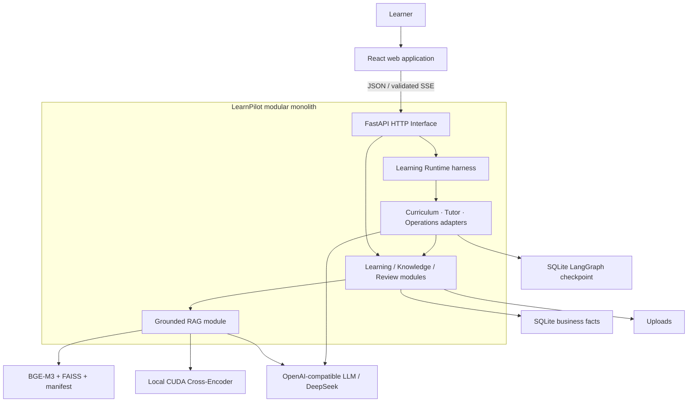
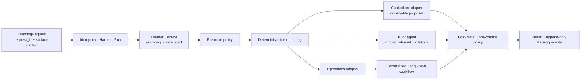
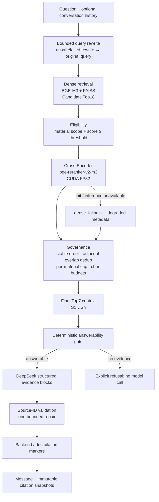

# LearnPilot Architecture

本文是 LearnPilot 当前 production architecture 的 canonical 说明。它描述已经存在的模块、Interface、Seam、Adapter、运行契约和证据；历史 `PersonalLearning` 名称只保留在仓库目录、数据库文件与内部符号中。

## 1. System Context

LearnPilot 是面向单个学习者的本地优先模块化单体。浏览器 UI、FastAPI backend、SQLite 业务状态、上传文件、FAISS index 与 LangGraph checkpoint 默认运行在同一台机器；只有配置为 OpenAI-compatible 的模型调用离开本机，当前 production provider 为 DeepSeek。Cross-Encoder 模型是仓库外的本地 snapshot。

Locality 是主要设计约束：学习事实和资料资产默认留在本机；发送给生成模型的 RAG 内容只包含本次被选入 final context 的片段。系统不是微服务，也不是面向多租户的云平台。

## 2. Frontend Architecture

`frontend/src/App.tsx` 定义 React Router route tree，并对页面做 lazy loading。主信息架构是：

- `/workspace`：Workbench；
- `/items`：目标与学习规划；
- `/knowledge`：资料、知识结构和 RAG Q&A；
- `/ai`：AI 协作；
- `/notes`：笔记深层入口；
- `/explore`：轻量 Discover；
- `/settings`：设置。

课程、课节、练习、测验、复习、掌握度等能力保留为 deep routes，旧 `/rag`、`/agent`、`/materials` 等入口通过 redirect 兼容。React components 负责交互与展示，TanStack Query 承担 server-state 生命周期，API clients 集中 HTTP contract，页面不直接访问数据库或模型。

SSE 不是未验证 token 的直接透传：RAG response 先在 backend 完成结构化验证、引用校验和持久化，再以事件块发送给前端。这条 Interface 保证刷新后可以从会话状态恢复已验证结果。

## 3. Backend Modules, Interfaces, and Seams

Backend 入口是 `backend/app/main.py`，HTTP routes 汇总在 `backend/app/api/router.py`。主要职责按以下深模块组织：

| Module / Interface | Owns | Does not own |
| --- | --- | --- |
| FastAPI HTTP Interface | route、request/response schema、public error envelope、dependency injection | 领域决策、模型 prompt、持久化规则 |
| Learning / planning modules | 目标、课程、知识点、计划、任务、课节、提案和状态转换 | RAG ranking、通用 HTTP 表现 |
| Knowledge module | 资料处理、chunk、embedding、FAISS index + manifest | 生成答案、学习规划 |
| RAG module | query rewrite、retrieval、rerank、governance、answerability、grounding、citation persistence | 课程/计划事实 |
| Learning Runtime | context load、policy、routing、harness run、resume、event recording | Course、Plan、Mastery、Quiz、Lesson 或 LLM 实现细节 |
| Adaptive / review modules | 确定性证据、掌握度/置信度、复习调度和建议 | 用 LLM 决定掌握状态 |
| Persistence adapters | SQLAlchemy repositories/models、SQLite transactions、FAISS filesystem state | UI 或 orchestration policy |

HTTP-to-domain 是明确的 Interface；RAG-to-vector-store、Learning-Runtime-to-capability 是可替换 Seam。`OperationsAgentAdapter` 是一个实际 Adapter：它把 harness 的小 `execute/resume` Interface 转换为既有 `AgentService` / LangGraph workflow，而不把 graph、checkpoint 或工具细节泄漏给 Learning Runtime。这个深度让上层生命周期保持简单，同时把复杂度封装在各模块内部。

## 4. Data and State

| State | Storage | Contract |
| --- | --- | --- |
| Goals、courses、knowledge points、plans、tasks、lessons、notes、activities、RAG conversations、harness runs/events | SQLite through SQLAlchemy | 业务事实；Alembic 管理 schema |
| Current migration | `20260809_0020` | Final Product Audit 确认 current=head、无 pending migration |
| Uploaded materials | local filesystem | SQLite 保存 metadata；删除与索引重建有显式流程 |
| Material chunks | SQLite | 真实资料片段与 location metadata |
| Dense vector index | FAISS `IndexFlatIP` | manifest 绑定模型、revision、dimension、chunk IDs 与 checksum |
| Agent graph checkpoint | separate SQLite file | 保存 LangGraph resume state；不是业务事实副本 |
| Reranker model | external local snapshot | `RAG_RERANKER_MODEL_PATH` 指向冻结 revision |

Final Product Audit 的只读检查结果是 `PRAGMA integrity_check=ok`、`foreign_key_check=0`。业务库默认文件名仍含历史 internal name；这是稳定的内部存储标识，不是用户可见产品品牌。

## 5. AI / Agent Flow

LearnPilot 的 AI 协作有两层，不能简化为“一个万能 Agent”，也不是自主多 Agent supervisor。

### 5.1 Learning Runtime harness

`LearningRuntime.handle/resume` 是顶层生命周期 Interface：

- Context Module 从明确的目标、课程、知识点、计划、会话和资料范围生成只读且带 hash version 的 `LearnerContext`。
- Policy Interface 检查 request conflict、context validity 与 optimistic context version；before-commit 再装载一次上下文以发现并发漂移。
- Router 用确定性信号把请求分到 curriculum、tutor、operations；没有模型驱动的 supervisor。
- Curriculum 生成等待用户审查的 proposal，不自动发布正式课程。
- Tutor 只能在当前资料 scope 内检索和解释，校验 source IDs，不拥有领域写入。
- Harness Run、result 和 Learning Event 提供幂等、审计、失败状态与 resume 关联。

Planning 与 Lesson generation 也以受约束的 proposal/draft Module 存在于具体 workflow Seam；它们不是互相自由调用的自治 Agent 网络。

### 5.2 Constrained operations workflow

Operations Adapter 复用既有 LangGraph StateGraph。图负责 load context → classify → bounded plan → validate → read tools → optional write confirmation → resume/write → persist：

- 最多 4 steps、3 个 read tools、1 个 write tool；禁止 write 后再 read。
- 明确的只读请求可走 deterministic fast route，仍经过同一个 plan schema 与 `ToolRegistry`。
- Write 只生成冻结参数的 proposal，使用 `interrupt` 等待人工 approve/reject；resume 前校验参数 snapshot。
- Stable thread ID、per-thread lock、SQLite checkpointer 和 request ID 提供恢复与幂等。
- Tools 是窄 Interface；没有 shell、SQL、任意文件、secret、环境变量、联网或绕过确认的工具。
- 公开错误经过稳定映射；内部 stack trace 只写 backend log。

## 6. RAG Pipeline

### 6.1 Production flow

### 6.2 Candidate depth is not context depth

`RAG_CANDIDATE_TOP_K=18` and `RAG_FINAL_CONTEXT_TOP_K=7` are separate optimization targets:

- Top18 increases the opportunity for required evidence to enter the reranker candidate set.
- Cross-Encoder compares query/chunk pairs and improves ordering precision.
- Eligibility and governance remove below-threshold, adjacent-overlap and over-concentrated sources.
- Top7 limits the final model context; per chunk and total context caps remain enforced (`RAG_MAX_CHUNK_CHARS=2200`, `RAG_MAX_CONTEXT_CHARS=12000`).

The final limit is also bounded by the request's `top_k`; normal production configuration permits no more than seven selected sources. The frozen Top7 replay measured `59/72` full-required coverage with `0/72` budget violations, serialized context P50 `5837`, P95 `6725.75`, max `7146` characters.

### 6.3 Why C, not Dense alone or Hybrid D

Frozen V1.1 arms were:

- A: Dense;
- C: Dense + Cross-Encoder;
- D: Dense + BM25 + RRF + the same Cross-Encoder/governance.

Blinded semantic review showed A→C improvement: fully correct `50→53/72`, `SUPPORTED_CORRECT 92→105/132`, answerability `60→67/72`. D produced no unique target fix relative to C in the main benchmark. In the later 10-case lexical/domain-shift stress, C and D both hit required evidence at Top18 in `9/10`; D had zero unique candidate or final fixes. LearnPilot therefore keeps the lower-complexity C path. This is evidence for this corpus and V1 trade-off, not a universal rejection of lexical retrieval.

## 7. Citation and Trust Model

Selected sources receive request-local labels `S1…Sn`. The LLM returns structured evidence blocks whose `source_ids` must be non-empty and belong to the allowed set. The backend rejects raw citation syntax in model-authored block text, deterministically renders `[Sx]` markers, and persists citation records with both live foreign keys and immutable filename/location/score/excerpt snapshots.

Two properties are deliberately separate:

1. **Citation validity**: every emitted ID resolves to a source actually selected into this request's final context; the answer shape and ID set pass structural validation.
2. **Citation semantic support**: the cited source really supports the associated claim and all required answer branches are covered.

A structurally valid citation can still be semantically weak or incomplete. The final 5-case closure resolved all 13 emitted citation IDs but one answer omitted a supported branch, so validity passed while semantic support passed 4/5. Observability stores `candidate_count`, `filtered_count`, `final_count`, retrieval mode, reranker status/device/dtype/batch count, fallback reason, durations, model usage and refusal/repair metadata.

## 8. Evaluation-to-Decision Chain

The canonical evidence is a decision chain, not a claim that every experiment should ship:

| Step | Question | Evidence | Decision |
| --- | --- | --- | --- |
| Dense baseline | What fails under local dense retrieval? | Frozen real-world corpus: 72 cases / 132 claims | Establish A and failure taxonomy |
| Preregistered B/C/D | Do query expansion, Cross-Encoder, or Hybrid address failures? | Sealed arms, machine checks, blinded claim review | C has semantic quality increment; D complementarity gate fails |
| Phase 4 gate | Is any arm ready with then-current CPU runtime? | C quality rises, but CPU latency violates hard gate | Keep A at that checkpoint; do not integrate C yet |
| ONNX CPU | Can equivalent CPU export remove latency blocker? | 72/72 semantic contract; PyTorch P50 `7797.0749 ms`, ONNX P50 `10411.82455 ms`, speedup `0.748867×` | Reject ONNX CPU |
| CUDA FP32 | Can C become interactive without semantic drift? | P50 `469.87155 ms`, P95 `589.380865 ms`, speedup `16.594056×`, peak reserved `2896 MiB`; all historical Top6 equivalence fields `72/72` | Accept CUDA FP32 runtime evidence |
| Lexical stress | Does D fix domain-shift cases missed by C? | C/D Hit@18 `9/10`; D unique fixes `0` | Keep C; omit BM25/RRF in V1 |
| Top7 boundary | Where should final context stop? | Top6/7/8 full coverage `57/59/59` of 72; Top7 unique fixes 2, Top8 unique fixes 0 | Decouple Top18 candidates from Top7 context |
| Production integration | Does source/config preserve contract and fallback? | Frozen replay, focused contract tests, singleton/degraded checks | Activate Top18 → CUDA C → Top7 with Dense fallback |
| Final product audit | Is the whole product releasable despite known generation variance? | Workflow/runtime/data audit, fixed 5-case closure | `PASS_WITH_P2`; generation omission documented, not promoted to 100% accuracy |

The earlier Phase 4 recommendation to keep A and the later production use of C are not contradictory: the former included a CPU latency hard gate; CUDA equivalence and profiling supplied the missing deployment evidence.

## 9. CUDA Runtime

The local reranker is `BAAI/bge-reranker-v2-m3`, frozen revision `953dc6f6f85a1b2dbfca4c34a2796e7dde08d41e`. `RerankerProvider` lazily creates one process-local instance, forces eval mode and FP32 on `cuda` / `cuda:<index>`, disables TF32/autocast, caps a request at 18 candidates, and exposes state/load/inference counters.

Canonical 72-query measurements:

| Measurement | Value |
| --- | ---: |
| CPU C warm P50 reference | `7797.075 ms` |
| CUDA total reranker P50 | `469.872 ms` |
| CUDA P95 | `589.381 ms` |
| CUDA mean | `483.315 ms` |
| CUDA max | `645.509 ms` |
| CPU→CUDA P50 speedup | `16.594×` |
| Warm peak reserved VRAM | `2896 MiB` |

The CUDA equivalence run used the historical governed Top6 contract and reported reranker ordering, governed Top6, final context and required evidence all `72/72`. The later Top7 choice was validated in a separate frozen deterministic replay; it must not be described as part of the earlier Top6 equivalence run.

The validated machine used Python 3.11.9 and `torch 2.12.1+cu126`. The PyTorch wheel supplies the CUDA runtime used here; a full standalone CUDA Toolkit 12.6 is not a LearnPilot startup requirement. A compatible NVIDIA driver and GPU are required for the primary path. `backend/requirements.txt` does not pin the CUDA wheel, so environment setup must make that choice explicitly.

## 10. Failure and Fallback Strategy

| Failure | Behavior | User/tracing signal |
| --- | --- | --- |
| Reranker snapshot missing/incomplete, CUDA unavailable, model init/inference failure | Provider becomes degraded; current and subsequent requests use deterministic Dense ordering and the same governance | `retrieval_mode=dense_fallback`, `reranker_status=degraded`, stable `reranker_fallback_reason`; no reload loop |
| Index missing/stale/unavailable or no eligible evidence | Refuse before answer generation | Explicit unavailable/refusal reason; zero answer-model calls |
| Query rewrite failure or suspicious entity introduction | Keep original question | Rewrite metadata shows fallback; retrieval continues |
| Invalid structured answer/citations | One bounded repair; if still invalid, stable refusal/error path | repair flag / validation reason; raw invalid model text is not returned |
| DeepSeek/configuration failure | Map to public retryable/non-sensitive error | No secret or raw stack trace in response |
| Context changes during harness execution | Reject through context-version policy | `context_version_conflict`; no silent stale commit |
| Proposed write | Pause at confirmation | frozen arguments, audit record, approve/reject resume |

Dense fallback is degraded but functional; it does not claim equivalent ranking quality to C. Empty evidence is different: the system refuses instead of generating an ungrounded answer.

## 11. ADR Summary

| Decision | Alternative | Evidence | Outcome |
| --- | --- | --- | --- |
| Dense + Cross-Encoder | Dense only | 50→53 fully correct; 92→105 supported correct claims; 60→67 answerability | Keep C when deployment latency is solved |
| No BM25/RRF in V1 | Hybrid D | No main-benchmark unique fixes; stress C/D 9/10, D unique 0 | Prefer shallower retrieval Module |
| PyTorch CUDA FP32 | PyTorch CPU / ONNX CPU | CPU 7.8s; ONNX 10.4s; CUDA 470ms P50 with frozen equivalence | Primary CUDA runtime |
| Final Top7 | Top6 / Top8 | 57/72 vs 59/72 vs 59/72; Top7 budget 0/72 | Top18 candidates, Top7 final context |
| Dense degraded fallback | Fail whole RAG request or repeatedly reload model | Deterministic fallback contract and final product audit | Continue with explicit degraded metadata |
| Local modular monolith | Microservices | Single-user/local state, transactional workflows, lower operational overhead | Keep interfaces internal; split only with demonstrated pressure |

## 12. Trade-offs and Known Limitations

- Local SQLite/FAISS minimizes deployment and privacy surface but is not a multi-user concurrency or horizontal-scaling architecture.
- External LLM calls still transfer the current prompt and selected context; local storage does not mean fully offline generation.
- The primary reranker path depends on a compatible NVIDIA GPU/driver and a separately installed CUDA PyTorch wheel. Dense fallback preserves availability, not the C quality increment.
- The current fixed model snapshot is machine-local and intentionally outside Git. Reproducibility comes from revision, required-file validation and `RAG_RERANKER_MODEL_PATH`, not an author-specific absolute path.
- Discover is intentionally lightweight; no claim is made for a mature recommendation system.
- The harness has specialized curriculum/tutor/operations capabilities but no autonomous supervisor, arbitrary inter-agent delegation, MCP, web search or long-term semantic memory platform.
- Final generation closure was 4/5 on a small fixed set: one complex FastAPI question had all `3/3` required evidence groups in Top7 and valid citations, but the answer covered only `2/3` supported branches by omitting external-threadpool behavior. The release review classifies this as a documented generation nondeterminism limitation, not a stable P0/P1 and not evidence of a general 20% failure rate.

## 13. Public Evidence

- [Public release summary](../evidence/release-summary.json)
- [Phase 4 blinded-review metrics](../evals/rag_real_world_corpus/v1/results/hybrid_rerank_phase4_v1_1/20260814T131417Z-04dfc031/unblinded_metrics.json)
- [ONNX final decision evidence](../evals/rag_real_world_corpus/v1/results/c_v1_2_onnx_runtime_equivalence/20260814T145246Z-298674d5/final_decision_evidence.json)
- [CUDA latency](../evals/rag_real_world_corpus/v1/results/c_v1_3b_cuda_fp32_full/20260816T050910Z-fbb5cec1/latency_results.json), [memory](../evals/rag_real_world_corpus/v1/results/c_v1_3b_cuda_fp32_full/20260816T050910Z-fbb5cec1/gpu_memory_results.json), and [equivalence](../evals/rag_real_world_corpus/v1/results/c_v1_3b_cuda_fp32_full/20260816T050910Z-fbb5cec1/equivalence_results.json)
- [Lexical/domain-shift stress](../evals/rag_real_world_corpus/v1/results/c_v1_4_lexical_domain_shift/20260816T061649Z-3dc82771/summary_metrics.json)
- [Top7 boundary decision](../evals/rag_real_world_corpus/v1/results/rag_context_selection_boundary_audit/20260816T094403Z-boundaryaudit/selection_boundary_decision.json) and [context budget validation](../evals/rag_real_world_corpus/v1/results/rag_candidate_final_depth_decoupling/20260816T101548Z-depthdecouple/context_budget_validation.json)
- [Final five-case generation/citation evidence](../evals/rag_real_world_corpus/v1/results/rag_one_final_closure/20260816T130718Z-onefinalclosure/final_e2e_results.json)

Operational startup is kept in the root [README](../README.md); this document deliberately does not duplicate secrets or author-machine absolute paths.
